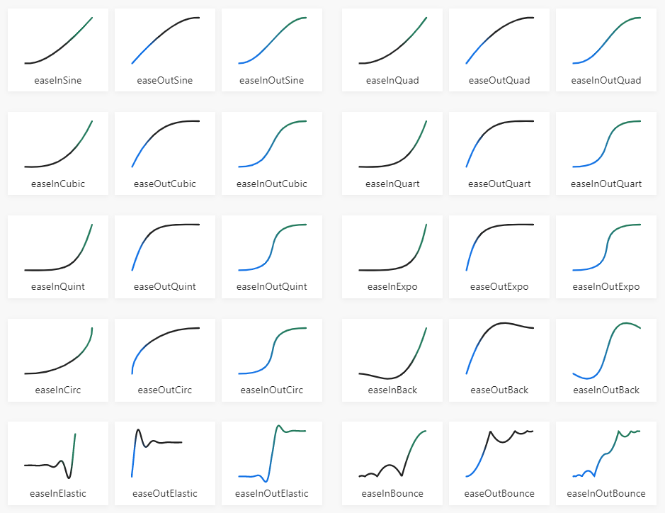

# Animation dialect for Red

**Animate** is an experimental animation dialect. It's main goal is to provide the programmers with an easy declarative way to describe simple animation as an extension to Draw. It also provides mechanism for animating arbitrary word! or path! values.

## Tween

At the heart of Animate is the process known as Inbetweening - that is generating intermediate frames between two keyframes. Animate uses a function called `tween` for this. It's syntax is as follows:

    tween <va11> <val2> <t> <ease>
  
    <val1>     :  Value to interpolate from  (number! pair! tuple!)
    <val2>     :  Value to interpolate to  (number! pair! tuple!) 
    <t>        :  a value between 0.0 and 1.0 (float!)   
    <ease>     :  Easing function (function!)
    

`tween` uses the indicated easing function to interpolate a value between `val1` and `val2` at `t` - a floating point number between 0.0 and 1.0. Using explicit calls to `tween` you can animate anything in Red, including GUI controls.

There are several predefined [easing](https://easings.net/) functions:

- ease-linear
- ease-in-sine
- ease-out-sine
- ease-in-out-sine
- ease-in-out-power
- ease-in-quad
- ease-out-quad
- ease-in-out-quad
- ease-in-cubic
- ease-out-cubic
- ease-in-out-cubic
- ease-in-quart
- ease-out-quart
- ease-in-out-quart
- ease-in-quint
- ease-out-quint
- ease-in-out-quint
- ease-in-expo
- ease-out-expo
- ease-in-out-expo
- ease-in-circ
- ease-out-circ
- ease-in-out-circ
- ease-in-back
- ease-out-back
- ease-in-out-back
- ease-in-elastic
- ease-out-elastic
- ease-in-out-elastic
- ease-in-bounce
- ease-out-bounce
- ease-in-out-bounce
- ease-steps

Screnshot taken from [easings.net](https://easings.net/)

## Animate and Draw

The main goal of Animate is to extend Draw in the time domain. This is done by using "augmented" draw block. Every block of Draw commands is a valid animation block. In order to animate the various Draw primitives, Animate introduces new keywords. Before we present them, let's see how to connect `animate` to Draw.

    anim-block: [
        ; Draw and Animate commands
    ]
    
    view [
        canvas: base 600x400 rate 67
        draw animate anim-block
    ]

The `animate` function parses a block of draw and animation commands, prepares all the tweens for the animation and returns a Draw block.

    animate <commands>
    
    <commands> : a block of Draw and animate commands (block!)
    
`animate` uses a global event handler to process `on-time` events and that's why the rate facet should be set for at least one face for animation to work.

## Animation reference frames

Before we start to animate the parameters of Draw commands, we need to indicate the reference frames.

    start <start> <duration> <delay> <ease> <loop>
    
    <start>      : starting time (<anim-start>)
    <duration    : (optional) duration of the animation (time! float! integer!). Default value 1.0
    <delay>      : (optional) delay between successive subanimations (time! float! integer!). Default value 0.0
    <ease>       : (optional) easing function (lit-word! function!). Default value  'ease-linear
    <loop>       : (optional) how does the animation repeat  (<anim-loop>). Default - no repetition
    <actors>     : (optional) actors for the animation events (<anim-actors>)
        
    <anim-start> : <start-n> | <adverb> <ref> <end>
    <start-n>    : (optional) time in seconds (time! float! integer!)
    <adverb>     : relation to the reference animation (word!)
    <ref>        : reference animation already declared (word!)
    <end>        : which side (word!)
    
    <adverb> is one of the following:
    - when
    - after
    - before 
    
    <end> is one of:
    - starts
    - ends
    
    anim-loop  : loop <two-way> <count>
    <two-way>   : (optional) 'two-way (the animation repeats backwards)
    <count>     : (optional) 'forever | <n> 'times
    <n>         : how many times does the animatin repeat (integer!)
    
	
### Examples - start:

    ref: start 2.0 duration 5.0
    start 1.0 before ref starts duration 2.0                  
    start when ref starts duration 3.0 ease :ease-in-out-cubic                 
    start 2.0 after ref starts duration 5.0              
    start 2.0 before ref ends duration 2.0 delay 1.0 ease :ease-in-out-cubic loop two-way
    start when ref ends duration 5.0 loop two-way forever
    start 2.0 after ref ends ease :ease-in-elastic loop 3 times
    
## From

The values set by `start` are used until the next `start` construct. A set-word! can precede `start` and thus the following animation frames can refer to it.
The `start` declaration does not animate anything by itself. In order to animate a value, one needs to use `from value1 to value2` syntax:

   <id> from <value> to <value>  <speed> <actors>
    
    <id> : (optional) identifier – only needed for pausing and resuming (set-word!)
    <value>  : start or end value to be animated (number! pair! tuple!)
    <speed> : (optional) animation speed (<anim-speed>)
    <actors> : (optional) <event> block!
    
    Actors specify blocks of code thata is evaluated at specific animation events. Events are:
    
    on-start  : once, at the animation start
    on-exit   : once, when the animation ends
    on-time   : each time the animation is updated. 

    anim-speed :  'speed <speed-value>
    <speed-value> : the speed value (number!)

`on-time` is triggered at the rate specified by the face to which the draw block is attached. `time` word can be used within the block following `on-time` - it holds the time elapsed from the animation start.
    
    
All numeric values in an animation block can be animated using `from` - integers, floats, pairs and tuples (for colors).

### Examples - from

    line-width from 1 to 10
    pen from black to red
    translate from 0x0 to 100x25 on-start [started: true]
    scale from 0.0 to 1.0 1.0 on-time [label/data: time] 
    box 10x10 from 10x10 to 200x50 one-exit [print "Finished!"]
    
Each `from` construct is translated at the parse time to a call to `tween` function. 

If `delay` in a `start` reference frame is non-zero, each animation defined by `from` starts the amount of `delay` later than the previous. That is why the actors are defined at `from` level and not at the `start` level. `start` could define a reference frame that starts at 1.0 with duration 5.0 and delay 1.0. If there are 3 values animated with `from`, the first one will start at 1.0, the second - at 2.0 and the third will start at 3.0 and will finish at 8.0. With actors defined at `from` level one can monitor each effect independently. That wouldn't have been possible if actors were used at `start` level.
Next `start` resets the delay.

# Effects

`Animate` introduces several effects that are meant to automate some of the more frequently used tasks in animations.

## Particles

`particles` animates a simple particle system:

    particles <id> <prototype> <expires> <actors>
     
    <id>        : effect identifier (word!)
    <prototype> : a block describing the particles (block! word!)
    <expires>   : (optional) when to clear the effect's draw black
    <speed>     : (optional) animation playing speed (‘speed number!)
    <actors>    : (optional) actors for the events

Prototype is a block of set-word! and value pairs that is used to create each individual partilce as well as to set up the entire effect:

    
    number:     <integer!>
    emitter:    <function!>
    absorber:   <function!>
    shapes:     <block!>
    forces:     <block!>
    ffd:        <integer! float!>
	    

Most of the above parameters are optional. If some is not present, the default value is obtained from the prototype object:

    particle-base: make object! [
        number:   100                  ; how many particles
        start:    1.0                  ; start time of the effect
        duration: 5.0                  ; duration of the effect
        elapsed:  0.0
        shapes:   speck                ; a block of draw blocks (shapes to be used to render particles)
        ffd:      0                    ; how many seconds of the animation to be skipped
        forces:   []                   ; what forces affect the particles motion - a block of words
        started:  false
        finished: false
        expires:  0                   ; when to clear the particle draw block
        paused:   false
        bi-dir:   false
        on-start: []
        on-time:  []
        on-exit:  []
    ]
	    
Only `emitter` and `absorber` are mandatory, since they define how the particles are generated and when they cease to exist and need to be respawned.

### Generation

`emitter` is a function with no arguments that returns a block that holds the parameters of the particle to be generated. These parameters are `x` and `y` coordinates (integer! float!) where the particle starts its life cycle, `dir` - direction in which it moves (integer! float!), `speed` - its speed (integer! float!). `color` (tuple! word!) can be used for fade-in and fade-out effects, but only if the description of the particle (given by `shapes`) does not include `fill-pen`, since it will overwrite this color. There is a time parameter `t` that holds the elapsed time for the particle. It can be used by `absorber` function to decide if its time 

So, the `emitter` function takes no arguments, generates some values and returns a block of named values for some or any of `x y dir speed color t` parameters:
	    
	    compose [x: (x) y: (y) dir: (d) speed: (s) t: (random 8.0)]
	
All the individual particle's parameters and their default values are listed below:
	    
    a-particle: context [
        x: 0.0                ; X position
        y: 0.0                ; Y position
        dir: 45.0             ; movement direction in degrees
        speed: 1.0            ; speed
        scale-x: 1.0          ; X scale factor 
        scale-y: 1.0          ; Y scale factor
        color: transparent    ; fill-pen color
        t: 0.0                ; elapsed time for the particle
        shape: []             ; drawing commands 
        data: none
    ]	    

	    
### Movement

At each frame the position of each particle is updated automatically using the `dir` and `speed`parameters. `dir` and `speed` (as well as any other parameter) can be  influenced by any functions in the `forces` block. Each force- function should receive a single parameter - a block of current particle's parameters and should return the block after modification.

**Example force- function**

     wind: function [p][
        if p/dir < 135 [p/dir: 135 + p/dir / 2.0]
        p/dir: p/dir + 2.0 - random 4.0
        p
    ]

### Respawn particles

The updated particle's coordinates are tested with the `absorber` function with particles's block as a single argument. If the function returns `true`, the particle's position is reset by invoking the `emitter` function.

**Examples for `absorber`**

    absorber: function [
        {Returns true if the particle needs to be re-emitted}
        p
    ][
        to-logic any [p/x < 50 p/x > 150 p/y < 50 p/y > 350]
    ]

### Expires

Since a particle effect usually displays hundreds and thousands of objects, it's to free the drawing resources when the effect finishes. `expires` and optional and if not present, the last drawn frame is kept in draw block. 

    expire after <time>
    
    <time>  : how many seconds after the beginning of the effect to clear the effect's draw commands (integer! float!)
    
The starting time of `particles` is taken from the last `start` (and subsequent `from`, if `delay` is non-zero). `duration` and `ease` - too. Looping doesn't make much sense for particle effects and that's why is not supported.

### Actors

`particles` and all other effects in `animate` support the same actors as `from`.

## Curve-fx

`curve-fx` flows a text or one or several draw blocks along a Bézier curve. Standard Bézier curves in Draw support 3 or 4 points. `curve-fx` supports up tp 30 points (not-thoroughly tested!).

    curve-fx <id> <effect> <value> <expires> <actors>
    
    <id>       : effect identifier (word!)
    <effect>   : effect data (block! word!)
    <value>    : position on the curve (float! (from float! to float!))
    <expires>  : (optional) when to clear the effects draw block (same as particles)
    <speed>    : (optional) animation playing speed (‘speed number!)
    <actors>   : (optional) on event actors (same as from)

Effect data is a block with set-word! and value pairs: 

    
    data: <string! block!>     (text or block of draw blocks)
    font: <object! word>       (optional - if data is a string)
    curve: <block!>            (a block of pairs - points of the Bézier curve)
    space-x: <float! integer!> (character spacing for strings - float!, or horizontal offset between blocks)

### Example - curve-fx

    fnt1: make font! [name: "Verdana" size: 16 color: black]
    red-text: "Red is a next-gen programming language, strongly inspired by REBOL"
    bez-pts: [50x40 370x-120 350x100 250x400 620x200] 
    red-info: [data: red-text font: fnt1 curve: bez-pts space-x: 0.98]
    
    block: [
        font fnt1
        start 1.0 duration 2.0 delay 1.0 ease :ease-in-out-cubic
        curve-fx Red-lang red-info from 1.0 to 0.0 expires after 5
    ]	
    

If the effect's data is block of draw blocks, the blocks are translated and oriented on the curve one after another starting at the current position and adding the offset along the curve.

## Text-fx

`text-fx` allows to easily animate text element's parameters: color, scaling and position. It can preocess the provided string in three modes: lines, words and characters.

    text-fx <fx-block> <parameters> <expires> <actors>
    
    <fx-block>    : a block defining the text effect (block!)
    <parameters>  : (optional) effect parameter name and values (params)
    <expires>     : (optional) when to clear the effects draw block (same as particles)
    <actors>      : (optional) on event actors (same as from)

`fx-block` is a block containing the data neded for creation and animation of the text. Here are the default values. One need to specifiy the id, text and font, the others can be obtained by the default values:
    
    id: none        ; identfier
    text: ""        ; text to render   
    font: none      ; font to use
    mode: 'chars    ; how to split the text  
    posXY: 0x0      ; where to place the text  
    sp-x:  1.0      ; spacing factor for X direction
    sp-y:  1.0      ; spacing factor for Y direction
    from: 'center   ; origin of scaling
    random: off     ; process the text element not in order, but randomly 
    
    mode is one of 'lines, 'words or 'chars

`params` are:
    
    text-scale <scale-value> <scale-value>
    text-move <move-value>
    text-color <color-value>
    
    scale-value : float! or (from float! to float!)
    move-value  : pair! or (from pair! to pair!)
    color-value : color-v or (from color-v to color-v)
    color-v: tuple! or word!
    
### Text-fx example

    fnt: make font! [name: "Brush Script MT" size: 28 color: 25.12.5.255]
    text: {Red’s ambitious goal is to build the world’s
    first full-stack language, a language you can
    use from system programming tasks,
    up to high-level scripting through DSL.}
    
    txt-bl: compose [
        id: 'test text: (text) font: (fnt)
        posXY: 20x20 sp-y: 0.75
        mode: 'chars from: 'center random: off
    ]
    
    anim-block: compose [
        fill-pen (papaya + 0.20.30)
        box 0x0 720x200
        st: start 2.0 duration 0.3 delay 0.02 ease :ease-in-out-cubic
        text-fx txt-bl text-scale from 4.0 to 1.0 from 4.0 to 1.0
        text-color from 25.12.5.255 to 25.12.5.0
    ]
    
In the above example the multiline string is displayed character after character (mode: 'chars). Both character scaling and color are animated at the same time. Characters start  big (4 times bigger) and transparent and at the end are their normal size and dark color. The time offset is controlled by `delay`.

## Stroke-path

`stroke-path` traces a block of drawing primitives and gradually displays the already traced part with a given color and line width.

    stroke-path <id> <path> width <width> color <color> <expires> <actors>
    
    <id>       : effect id   (word!)
    <path>     : a block of lines, arcs and custom Bézier curves (block!)
    <width>    : line width (integer!)
    <color>    : line color (tuple! word!)
    <expires>  : (optional) when to clear the effects draw block (same as particles)
    <speed>    : (optional) animation playing speed (‘speed number!)
    <actors>   : (optional) on event actors (same as from)
    
Path contents are limited to just three types of primitives: lines, circular arcs and custom (multipoint) Bézier curves. The path is not closed automatically. Please note that only the `x` radius of an arc is used (no elliptical arcs)

### Stroke-path example

    path: [
       line 100x100 220x100 180x200 250x200
       arc 250x250 50x50 270 90 
       bezier 300x250 320x400 450x200 500x300
    ]
    
    path-block: compose [
        line-cap round
        start 1 duration 2 ease :ease-in-out-quad
        stroke-path test (path) width 15 color red expires after 4
        on-start [print "Starting path1"]
    ]

## Morph path

`morph-path` takes a path and morphs it into another path. The paths are the same as in `stroke-path`.

    morph-path <id> <path> into <path> <visible> <expires> <actors>
    
    <id>       : an identifier – used to pause and resume the effect (word!)
    <path>     : a block of lines, arcs and custom Bézier curves (block!)
    <visible>  : (optional) Is the first block displayed at the start? <visible <logic!>> 
    <expires>  : (optional) when to clear the effects draw block (same as particles)
    <speed>    : (optional) animation playing speed (‘speed number!)
    <actors>   : (optional) on event actors (same as from)

### Morph-path example

    path1: [
        arc 200x200 180x180 180 180
        arc 200x200 180x180 0 180
    ]

    path2: [
        line 100x100 250x100 arc 250x150 50x50 270 90 line 300x150 300x250
        bezier 300x250 250x350 200x250 150x200 100x250
        line 100x250 100x100
    ]
    
    morph-path-block: compose/deep [
        pen red
        line-width 3
        line-cap round
        start 2 duration 2 ease :ease-in-out-quint
        morph-path morph (path1) into (path2) visible true expires after 2
    ]

`morph-path` uses the current pen and line-width settings.

For best results it's a good idea to match the starting point of the path as close as possible. The number of points of the paths doesn't matter.

# Animation speed

When you need to play an animation within a `start` reference frame with a different speed, you can use the `speed` parameter. It is supported by both simple animations (`from`) and all effects with the exception of `text-fx`

## Animation speed examples:

    translate white-box: from 30x95 to 550x95 speed 2.5 [box 0x0 20x20]
    particles fleet rocket expires after 6 speed 2
    curve-fx info red-info from 1.0 to 0.0 expires after 6 speed 125%
	    

# Pausing and resuming animations

`toggle-animation` function can be used to pause or resume an animation. It needs only one argument - a `lit-word!` identifying the animation. It doesn't currently work for `text-fx` effect, because it uses a different approach.
	    
## `toggle-animation` example
	   
    toggle-animation 'vulcano
	    
Please note that `toggle-animation` is usually used in your event-processing code.
	    

# Ideas for future work
There are many things that can be added to the animation system:

## Animation control
- stop
- rewind
- ffd

## Text-fx to work on specified parts of text
Now it works on all components, depending on the mode - lines, words or characters. It would be good to specify which ones to animate. Possible parameters: index, range, or block of indices.

## Frames
An effect that changes the content of an image frame by frame

## 2d Arrays
- rectangular
- polar

## Parallax effect

## Collision detection

## Physics
